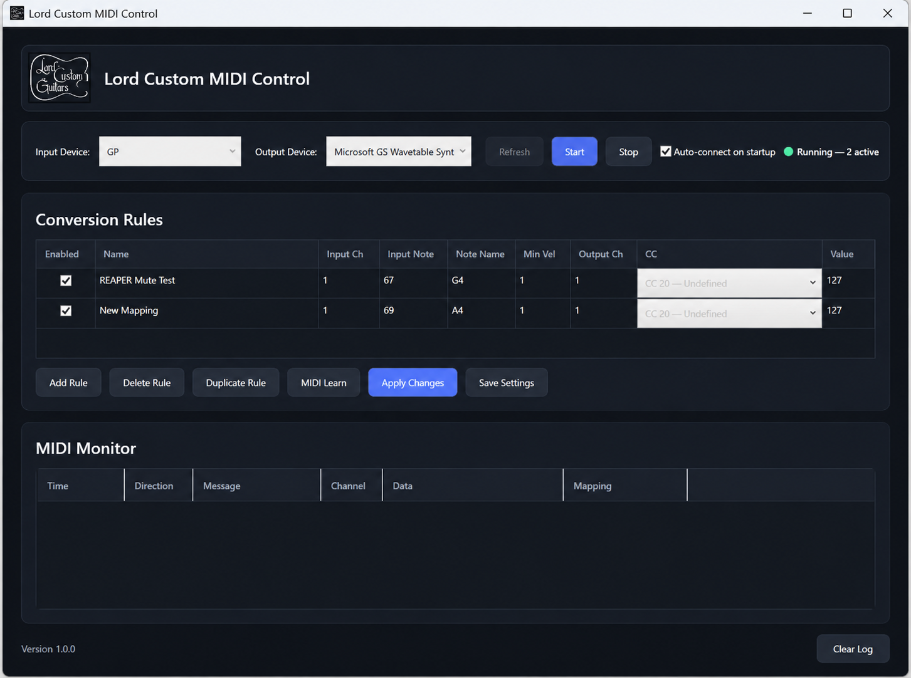

# Lord Custom MIDI Control

A Windows utility that converts incoming MIDI notes into MIDI Control Change messages.

## Features

✅ MIDI Learn
✅ Configurable mappings
✅ Live MIDI monitor
✅ Auto-connect
✅ JSON settings
✅ Dark UI
✅ Guitar Pro → REAPER workflow

## Requirements

- Windows 10/11
- loopMIDI
- Guitar Pro
- REAPER

## Screenshot

## Download

Latest release:
Releases → v1.0.0
